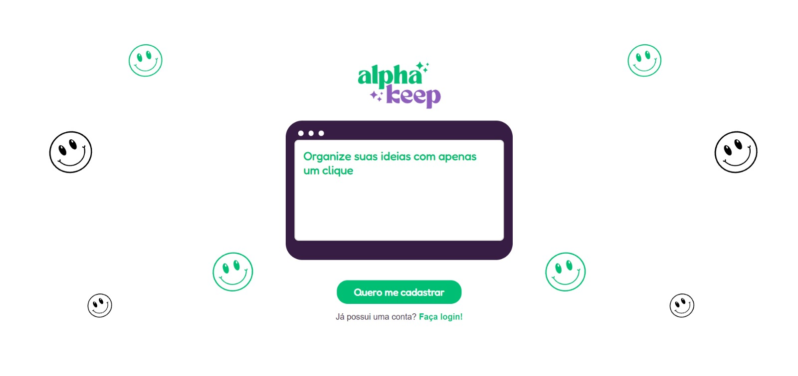

<h1 align="center">
  Alpha Keep
  <br>
  <br>
</h1>

<h4 align="center">Save your notes. Organize your life. Use AI to help you find your notes.</h4>


<p align="center">
  <a href="#key-features">Key Features</a> •
  <a href="#how-to-intall">How To Install</a> •
  <a href="#how-to-use">How To Use</a> •
  <a href="#technologies">Technologies</a> •
  <a href="#collaborators">Collaborators</a> •
</p>



## Key Features

* Save your notes 
  - Save all your important things in onde place.
* Save Images
  - You can also add images to your note.
* Save Youtube Videos
  - That video you loved and wanna watch again? Save it here!
<h3>Forgot where you saved that image or video that you loved?? <br><br>No problem!!</h3>
<h4>Our AI system will help you search for the notes, images or videos just by writing similar things they had on it!</h4>

For example:
* I had an image with a cat o it....
* There was a video where a person was dancing....
* Our AI search will bring you the results!! You don't need to remember what exactly was written there!!


## How To Install

To clone and run this application, you'll need [Git](https://git-scm.com) and [Node.js](https://nodejs.org/en/download/) (which comes with [npm](http://npmjs.com)) installed on your computer. From your command line:

```bash
# Clone this repository
$ git clone https://github.com/Raissa-Reis-Lopes/Alpha_keep.git

# Go into the repository
$ cd Alpha_Keep

# Go into the backend folder
$ cd backend

# Install dependencies
$ npm install

#return
$ cd ..

# Go into the frontend folder
$ cd frontend

# Install dependencies
$ npm install

#return
$ cd ..

# If you are using Docker, run
$ docker compose up

# Go into the backend folder
$ cd backend

# Run
$ npm run build
$ npm run start

#return
$ cd ..

# Go into the frontend folder
$ cd frontend

# Run
$ npm run build
$ npm run start

